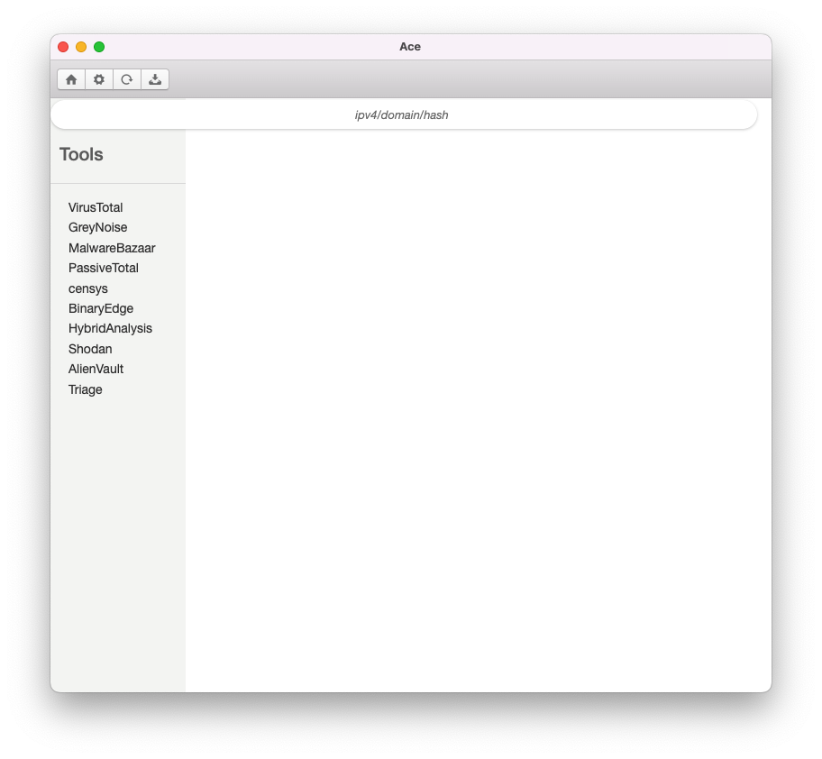

# ace
A quick project put together to learn HTML, CSS, and JavaScript. This app has API endpoint integration with various 3rd party scanner services to query at once.

## Installation Instructions
You can download the binary from the releases page or build locally if you want to

## Usage
1. When the app is launched, open the Settings menu by clicking on the "cog" icon from ace's home screen
2. Paste in your API keys and click on "Save"
3. Enter in your search query into the search box
4. Note: results may take couple of seconds to complete and return
5. Raw JSON data from the API endpoints are returned to view
